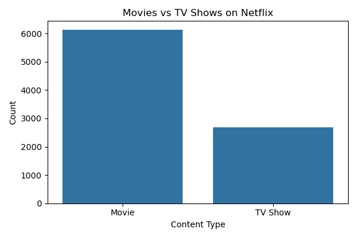
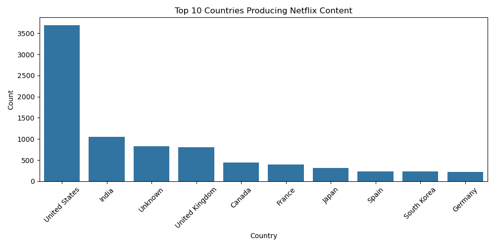
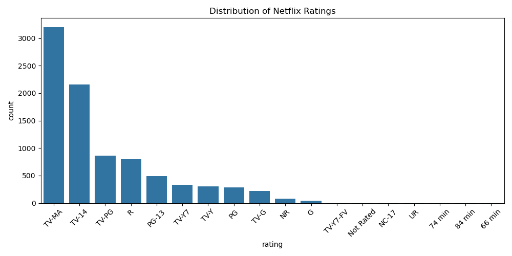
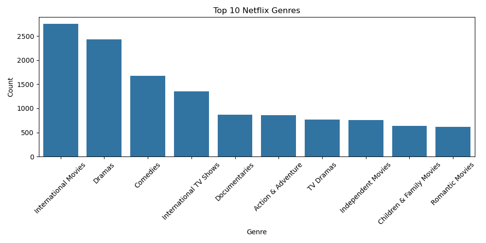

# 🎬 Netflix Data Analysis using Python

## 📌 Project Overview

This project analyzes the Netflix Movies and TV Shows dataset using Python. The goal is to perform data cleaning, exploratory data analysis (EDA), and visualize insights about Netflix's content library.

---

## 📂 Dataset

- Dataset: Netflix Movies and TV Shows
- Source: Kaggle
- Format: CSV

---

## 🎯 Objectives

- Clean and preprocess the dataset
- Handle missing values
- Perform Exploratory Data Analysis (EDA)
- Visualize trends using Seaborn and Matplotlib
- Extract meaningful insights from the data

---

## 🛠️ Technologies Used

- Python
- Pandas
- NumPy
- Matplotlib
- Seaborn
- Jupyter Notebook

---

## 📊 Visualizations

This project includes:

- Movies vs TV Shows
- Top 10 Countries
- Rating Distribution
- Content Added Over the Years
- Top 10 Genres
- Release Year Trend
- Movie Duration Distribution
- Top Directors
- Correlation Heatmap

---

## 🔍 Key Insights

- Movies are more common than TV Shows.
- The United States has the highest number of Netflix titles.
- Netflix rapidly expanded its content library between 2016 and 2019.
- TV-MA is one of the most frequent content ratings.
- International Movies and Dramas are among the most popular genres.
- Most movies have a runtime between 90 and 120 minutes.

---

## 📁 Project Structure

```
Netflix-Data-Analysis/
│
├── dataset/
│   ├── netflix_titles.csv
│   └── netflix_cleaned.csv
│
├── notebook/
│   └── netflix_analysis.ipynb
│
├── images/
│   ├── movies_vs_tvshows.png
│   ├── top10_countries.png
│   ├── ratings_distribution.png
│   ├── content_added_over_years.png
│   ├── top10_genres.png
│   ├── release_trend.png
│   ├── movie_duration_distribution.png
│   ├── top_directors.png
│   └── correlation_heatmap.png
│
├── README.md
├── requirements.txt
└── .gitignore
```

---

## 🚀 How to Run

1. Clone the repository

```
git clone <repository-link>
```

2. Install the dependencies

```
pip install -r requirements.txt
```

3. Open the notebook

```
jupyter notebook
```

4. Run all the cells.

---

## 📈 Future Improvements

- Build an interactive dashboard using Power BI or Tableau
- Create a Streamlit web application
- Develop a recommendation system using Machine Learning

---

## 👨‍💻 Author

**Uday Dherange**

Computer Science Engineering Student | Aspiring Data Scientist


## Sample Visualizations

### Movies vs TV Shows



### Top 10 Countries



### Ratings Distribution



### Top Genres

